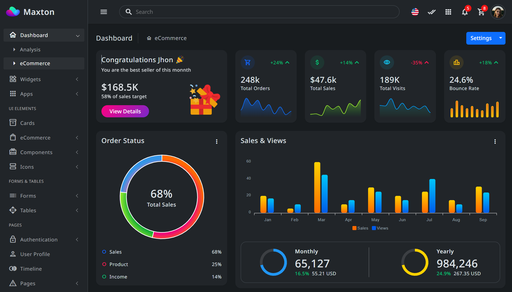

# Markdown
description of project
## heading two
### heading three
#### heading four

## Text format

Hell **bold**

*italic text*

~~delete text~~

normal text

## Check list
- [x] Task 1
- [x] Task 2
---
- [ ] Task 3
- [ ] Task 4

## Table 
|id | name | age | status |
|---|------|-----|--------|
|01 | rady | 303 | True   |
|01 | rady | 303 | True   |
|01 | rady | 303 | True   |

## Block Quote

> This markdown block quote

## List
- List 1
- List 2
- List 3
  - sub 1
  - sub 2

1. List 1
2. List 2
3. List 3
    1. sub 1
    2. sub 2

## Image 


## Link 
CSS Framework [Bootstrap](https://getbootstrap.com/)

## Singlie line code
`print("hello world")`

## multiple line 
```python
for i in range(10):
    print(i)
```
```html
<h1>Hello</h1>
<p> Text </p>
```
```bash
npm i express
pip install cv2
composer install
```